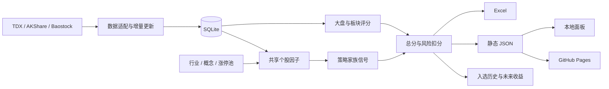

# 架构说明

## 数据流



## 每日任务

`src/run_daily.py` 负责以下顺序：

1. 载入 YAML 配置并初始化数据库表
2. 执行历史补全或每日增量更新
3. 计算数据健康并确定有效报告日期
4. 构建股票池和风险过滤名单
5. 计算市场、板块、股性、量价和 RPS 因子
6. 一次性构建共享策略特征
7. 运行启用策略并按家族去重
8. 计算风险扣分和总分排名
9. 为 Top N 补充细分行业、概念、涨停线索和行业阶段表现
10. 保存 Top N 历史并回填未来收益
11. 生成 Excel、JSON 和静态网页
12. 写入任务状态

## 数据提供者

默认 `tdx`：

- 不需要用户名或密码
- 支持主机故障转移
- 支持分块并行初始化
- 支持断点续跑和增量更新
- 系统性失败时使用熔断，避免无限重试

`akshare`、`baostock` 和 `mixed` 仍可配置，但不作为默认生产路径。

## 候选股背景信息

`src/stock_context.py` 只为排名靠前的候选股补充背景，不参与基础行情更新，也不会因网络失败中断报告：

- `stock_context` 缓存东方财富 F10 的一级行业、细分行业和核心概念
- `stock_event` 保存报告日涨停池事实，仅将概念关联描述为“线索”，不冒充新闻涨停原因
- `sector_context` 使用申万一级行业指数，保存 5 / 20 / 120 日表现和近 20 日异动次数
- 长说明进入 Excel 和个股详情抽屉，观察名单表格只使用短标签

缓存规模由 `features.context_top_n` 和 `context_cache_days` 控制。

## 策略因子缓存

`build_strategy_features` 对每个报告日期统一计算均线、阶段高低点、收益、波动率、量比、突破状态和距离均线等字段。策略只能消费共享结果，不应各自重复滚动计算。

同一家族的多个策略可能描述相近市场行为，因此总策略原始分为：

```text
策略分 = 各家族命中策略的最高分之和，最高 100
```

## 报告契约

`build_report_payload` 输出带 `schema_version` 的 JSON，包含：

- `market`
- `health`
- `strong_sectors`
- `top50`
- `top10`
- `strategy_performance`
- `strategy_distribution`

本地面板先读取 `/api/latest`；GitHub Pages 使用 `site/data/latest.json`，两者共享前端。

## 部署边界

- 本机：`start.bat` + FastAPI / Uvicorn
- 自动任务：Windows Task Scheduler 调用 `scripts/bootstrap.py`
- 容器：Docker Compose 挂载配置、数据库、报告、日志和站点
- 手机只读：本地任务生成 `site/`，GitHub Actions 只负责部署
- 服务器：Docker 面板置于带 HTTPS 和身份验证的反向代理之后

数据库不进入 GitHub，也不由 GitHub Actions 每日重建。
